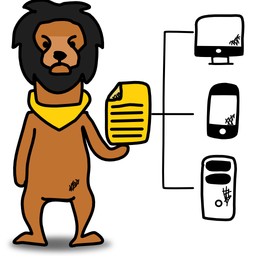

Kore - The Simplest Distributed Log Database
============================================

Are you looking for a simple
database to store and manage your
data across multiple devices?
**Kore** is the solution you need.

First we had
[Lambda](https://en.wikipedia.org/wiki/Lambda_architecture).
Then we had [Kappa](http://milinda.pathirage.org/kappa-architecture.com/)...

And now, at last, we have **KORE**!




**Kore** - The Simplest Distributed Log Database

## Is Kore for me?

**Kore** is ideal for you if you
have an app that runs on multiple
devices (say a web and mobile app),
that need to share a simple DB and
need to tolerate being disconnected
occasionally.

**Kore** will allow you to quickly
and easily set up your initial data,
improve your handling of it
iteratively, and handle cross device
synchronization with near-realtime
updates.

## Is Kore NOT for me?

**Kore** is not for you if you need
a database with a heavy load
(thousands of requests a minute).
Otherwise **Kore** is an interesting
option you could keep in your
toolbox for apps and side-projects.

Let's get started with a brief look
at why 'Log Databases' are a such an
exciting solution in the first place.

# Why Log Databases?

The Log is such a simple data
structure that for many years
[we've overlooked it's potential](https://engineering.linkedin.com/distributed-systems/log-what-every-software-engineer-should-know-about-real-time-datas-unifying).
After all a 'log file' seems so
absurdly simple it is often just an
afterthought. It can feel like a
completely a trivial data structure.
And yet it is this very simplicity that
makes the log such a tremendously
powerful abstraction.

At it's core the log is a set of
'append-only' records of no
particular format. Each log has a
name and the records are ordered but
that's about it.


Now just what _are_ the interesting
properties of the log? Well firstly
it is **immutable**.
This brings with it all the nice
properties that we associate with
immutability including the ability
to be accessed by multiple clients
without fear.
To take this property further
**Kore** ensures that every log has
only one _owner_ that can write to
the log.  Everyone else is a reader.

The second property of the log is
that, being largely unstructured, it
is _future-proof_. As new
requirements come in, new record
types can simply be added without
needing older clients to be
upgraded. They will simply ignore
records they do not understand.

The third property of the log is
that it is _easy to merge_. This
means that given multiple logs, we
can easily create a set of rules
that allow anyone with the same set
of logs to end up with the same
global ordering of records. This
property makes it ideal for a
distributed database allowing for a
very simple way to get eventual
consistency.

Finally, because the log itself has
no processing logic of it's own the
data management algorithms are
separated out and can become more
and more sophisticated while still
operating on the same log data.
Simply decoupling the processing
from the data gathering stage makes
it a far more powerful system to use
and grow. Gather all the data you
can and figure out what to do with
it later.

## Light's...Camera...Action!

Let's see how this would work in _action_.


For this let's look at the canonical
example - a *TO-DO LIST*

We start off our log just by
recording entries in our list:

```
[Log: MyList]

1 { do: Buy Milk }
2 { do: Buy Cheese }
3 { do: Remember I'm Lactose Intolerant }
4 ...
```

Now we meet Alice (whom we've always
had a kind of secret crush on) and
she gives us her number! Yes! Let's
record that too. Our To-do
application may not be able to
understand it now, but we know we
can make it understand it going
forward.

```
[Log: MyList]

1 { do: Buy Milk }
2 { do: Buy Cheese }
3 { do: Remember I'm Lactose Intolerant }
4 { name: Alice <3, number: +99 887 886 }
5 ...
```

Isn't this nice? We can just add
things and worry about dealing with
them later.

Now let's imagine we like our TO-DO
app so much we put it everywhere -
(like on our phone AND our iPad!)

```
[Log: MyList - PhoneLog]
1 { do: Buy Milk }
2 { do: Buy Cheese }
3 { do: Remember I'm Lactose Intolerant }
4 { name: Alice <3, number: +99 887 886 }
5 ...

[Log: MyList - PadLog]
1 { do: Pick up dinner }
2 ...
```

These combine to give us our
complete list (on both the phone and
iPad):

```
[Log: MyList]
1 { do: Pick up dinner }
1 { do: Buy Milk }
2 { do: Buy Cheese }
3 { do: Remember I'm Lactose Intolerant }
4 { name: Alice <3, number: +99 887 886 }
```

Now supposed we change a record on
the iPad and change _the same
record_ on the phone. What would
happen?

The first thing to notice is that we
cannot edit a record anyway so the
way to change it is to create a new
'update' record.

```
[Log: MyList - PhoneLog]
3 ...
4 { name: Alice <3, number: +99 887 886 }
5 { change: { name: Alice <3 }, to: { name: I hate Alice } }
6 ...
```

And the same on the iPad:
```
[Log: MyList - PadLog]
7 ...
8 { change: { number: +99 887 886 }, to: { number: +99 776 665 } }
9 ...
```

Now combining them is easy! No more
overwriting issues.

```
[Log: MyList - PadLog]
3 ...
4 { name: Alice <3, number: +99 887 886 }
5 { change: { name: Alice <3 }, to: { name: I hate Alice } }
6 ...
7 ...
8 { change: { number: +99 887 886 }, to: { number: +99 776 665 } }
9 ...
```


"Ho!" Tom the skeptic cries, "This is just [fAkE
nEWs](https://edition.cnn.com/)! What if we don't arrange our
records in this neat little way with
nice change sets?"

Fair enough. Let's look at a simpler
version. Say the record is updated
simply by writing a complete new
version and not by making a 'change'
record. How would that look?

```
[Log: MyList - PhoneLog]
3 ...
4 { name: Alice <3, number: +99 887 886 }
5 { name: I hate Alice, number: +99 887 886 }
6 ...

[Log: MyList - PadLog]
7 ...
8 { name: Alice <3, number: +99 776 665 }
9 ...
```

Now this record, you could argue,
would have the same problem as a
mutable record - one of the records
is going to overwrite the other.

However - here is where the magic of
separating data capture from data
processing comes in!


A simple processor would indeed
cause the records to overwrite each
other and so we would 'loose' the
changes. However, because processing
is separated out the underlying data
is still available and we can
imagine at some point simply
upgrading the processor so it can
handle this case as well.

How can we do this? We could realize
that people tend to update only
parts of a record when they make
changes. So the processor can simply
check the latest update with the
previous version to find what has
changed.

```
[Log: MyList - PhoneLog]
3 ...
4 { name: Alice <3, number: +99 887 886 }
5 { name: I hate Alice, number: +99 887 886 }
    --> Processor derives: { change: { name: I hate Alice } }
6 ...

[Log: MyList - PadLog]
7 ...
8 { name: Alice <3, number: +99 776 665 }
    --> Processor derives: { change: { number: +99 776 665 } }
9 ...
```

And - magically - we have been able
to solve the overwriting issue and
bring back the correct data. And all
because the _underlying data is
always available_ - just waiting for
cleverer processing algorithms to
give cleverer results.

Amazing isn't it?


# The Core of Kore

**Kore** manages the storage and
synchronization of log records for
your application.


As you can see, a **Kore** node can
store logs locally, and/or can
connect to other nodes to
synchronize logs, and/or can listen
for connections from other nodes.


```
const kore = require('core')
...

// Add a new record
kore.addRec({ a: 'new record' }, 'MyList')

// Process incoming records
kore.setLogUpdate((rec) => {...})

// Set who am i (see 'Who Am I' note below)
DEVICE_ID = kore.uuid()
kore.setWhoAmI(DEVICE_ID)

// Save logs locally in given DB
// folder
kore.setSaveLocation(<path to database folder>)

// Connect to other nodes to
// synchronize our logs
kore.addConnection(<http url>)

// Start server that other nodes can
// use to synchronize with
kore.startServer(<port number to listen>)

// Inject a handler to examine all
// incoming requests (to allow you
// to hook into any authentication
// system you like).
kore.checkReq((req) => {
    return 500 // Auth failed
    return null // can continue
})
```

## Who Am I
It is recommended that you set a
UUID for every node that is
running kore. You can use the
function `kore.uuid()` to generate
the UUID for your node and store it
so it can be provided every time on
start up.

If you do not provide this, kore
auto-generates a uuid every time
it starts up - which means that
there could be a large number of
internal logs that need to be merged
which can cause `kore` to slow down
somewhat.

# Migration

At some point, you may want to clean
up your logs and move to a fresh new
system. "Out with the old and bring
in the new" is your motto as you
sweep out old records and formats and
start with a clean new slate.

You want to do this? No problem.
**Kore** supports you
whole-heartedly. **Kore** allows you
to provide a 'migration function'
that transforms your old log into a
new one.

To do this, designate _one_ of you
nodes as the migrator. This node
will accept the migration function:

```
kore.migrate('MyList', 'MyList2', (rec) => {
    // You can remove records
    if(rec.name == 'Alice') return false
    // Modify them
    if(rec.type == 'appointment') {
        rec.type == 'calendar'
        ...
        return rec
    }
    // Split into multiple
    if(rec.type == 'xxx') {
        return [ split_rec1(rec), split_rec2(rec) ]
    }
    // Just pass through
    return rec
})
```

Your nodes should then move over to
using the new log ('MyList2') and
then - gradually, you can remove
support for the old log ('MyList1').
As older nodes continue to write to
the old list the migrator node will
migrate those records over to the
new log so you can move over
systematically and stop supporting
the old logs after some time.

# How to Contribute to Kore
**Kore** is open to everyone and any
help is greatly appreciated.  Feel
free to
[raise issues](https://github.com/theproductiveprogrammer/kore/issues),
[contribute features](https://github.com/theproductiveprogrammer/kore/pulls),
[improve the documentation](https://github.com/theproductiveprogrammer/kore/pulls),
or simply
[add your suggestions](https://github.com/theproductiveprogrammer/kore/issues).


# Pending Features

* Support for other languages
  (Python, Java, ...)
